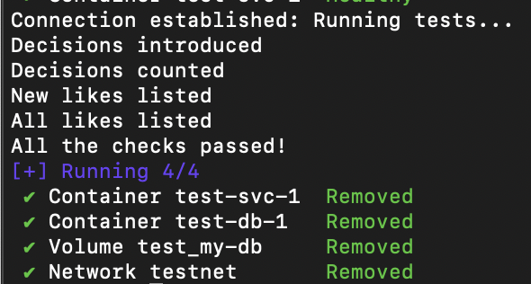

# Muzz Explore service

## Project structure

The project consists of 4 folders:

- `cmd` contains the main file, and should contain any other entry-points that this project may have.
- `internal` contains the packages that are used in other areas of the project.
    - `api` contains the protobuff schema, and the autogenerated code coming from that schema.
    - `store` contains the stores used by the service.
        - `cache` empty folder illustrating where a cache (i.e., Redis) would go if we wanted to add it.
        - `database` contains the code in charge of the database connection and its queries.
- `server` contains the definition of the `ServiceServer`.
- `test` contains the code to run a set of integration tests that check the system as a whole (more on that below).
    - `config` contains the configuration needed to raise the service locally
    - `sql` the sentence to create the DB for the integration tests

## Assumptions & Decisions

- When a _like_ decision is introduced, an error can happen when looking for the reverse decision to verify if it's a match. In that scenario, an error is returned, and the response is filled with `MutualLikes` as false. It's a misbehavior, but I assume that nothing will be lost, as it will appear at the new likes response (and section).
- I have no experience with MySQL (I've always used PostgreSQL and a little bit of MicrosoftSQL), but I decided to use it on this exercise as it is the DB you use. I may be doing suboptimal things due to the lack of knowledge of good practices!
- Decided that the `PutDecision` endpoint is an upsert entrypoint, so decisions can be overridden using that endpoint.
- For the _new_ likes, I decided to model them with a flag inside the database, per each decision. I could for simplicity leave the responsibility of marking the decisions as "not new" to the caller, so it does it through the `PutDecision` endpoint, but to be consistent internally, I decided to mark the decisions as seen as soon as they are returned.
    - I also decided to make those calls asynchronously, as there's no need to make the caller wait for that update to be done.

## How to test

There are 2 sets of tests on this exercise, the unit tests and the integration tests.

### Unit tests

Basic go unit-tests that can be called using the classic `go test` command. For example, this can be used at project's root:
```sh
go test ./... -v -race
```

### Integration tests

This test suit is composed by a go script (`test/main.go`) that creates a gRPC client, a `docker-compose` file that defines both a mysql database and the explore-service, and some extra files to help. The mission is to test the explore-service as a whole, creating it and the database, and doing requests through the client. To run it, I facilitated a script that is at the project's root called `run_integration_tests.sh`, which recreates the DB, wakes up an instance of the server, and runs the go script. You should expect to see something like this at the end of the run:



## Future improvements

There are a few things that were not added to the service but should be relevant in a productionised one. Most of them were not added due to lack of time, as I preferred to provide the core features well done and tested. Please feel free to reach out to me if you would like to see me implement any of these areas!

### Pagination improvements

I did a cursor-based pagination using `actor_user_id` and `recipient_user_id` as keys, by joining them with a `##` in between. Of course this is not elegant, the generated page token should be something like a decryptable hash, so it's not that explicit what's happening behind the curtains.

Another improvement I would have liked to add is to add some test checking pagination usage in the integration tests.

And, another small improvement would be change the page size constant to be a config parameter, so it can be changed without changing the code, if we ever want.

### Optimize queries

Some queries can be optimised. For example, I would add an extra parameter on the `ListDecisions` method to receive the list of parameters that we want to receive, so we can do the `SELECT` query with the requested arguments instead of a `*`, which would be much more performant, especially because the `ListLikes` and `ListNewLikes` only use 2 parameters.

### Validations

Should any validation be added, it should be added into the `ServiceServer` methods. I didn't add any as gRPC already ensures that the request meets some minimum requirements (type of the fields, optionality, etc).

### Cache

A good way to improve performance is to add a cache on top of the main database, as it is faster and reduces pressure on the database. I left the folder where I would place the code for the cache.

For example, we can have a Redis, where we store DB related results with a TTL, so whenever they are re-requested, we don't need to hit the MySQL database, and we can obtain it through the cache.

### Concurrency control on DB side

Assuming we want this service to scale, so it will have multiple replicas accessing the database, some sort of concurrency control on the DB side should be added. As mentioned, I lack knowledge about good practices of MySQL, and that's why it was not added in this exercise (I should need to investigate how it works). But certainly, some concurrency problems can happen, like ghost reads (i.e. we obtain a match when the other partner has changed his/her decision). It's not critical, but it would be good to have that concurrency control.

### User data

The requirements described on the document allow the database to NOT have users in it, we only need its IDs. For this reason and for simplicity, there was no user table used for this exercise. In a real example, the user table would exist, where its description, photos, and other data could be stored, and its IDs would be the ones used on the decision table as foreign keys.

### Improve error handling

For simplicity of the code and during debugging, I followed the approach of raising ALL the errors to the top. This is a BAD PRACTICE, as we can be exposing database implementation details to the callers. Ideally the store model would have some generic errors defined, log any explicit errors and return the generic ones, so the server can decide what kind of response has to be returned.
